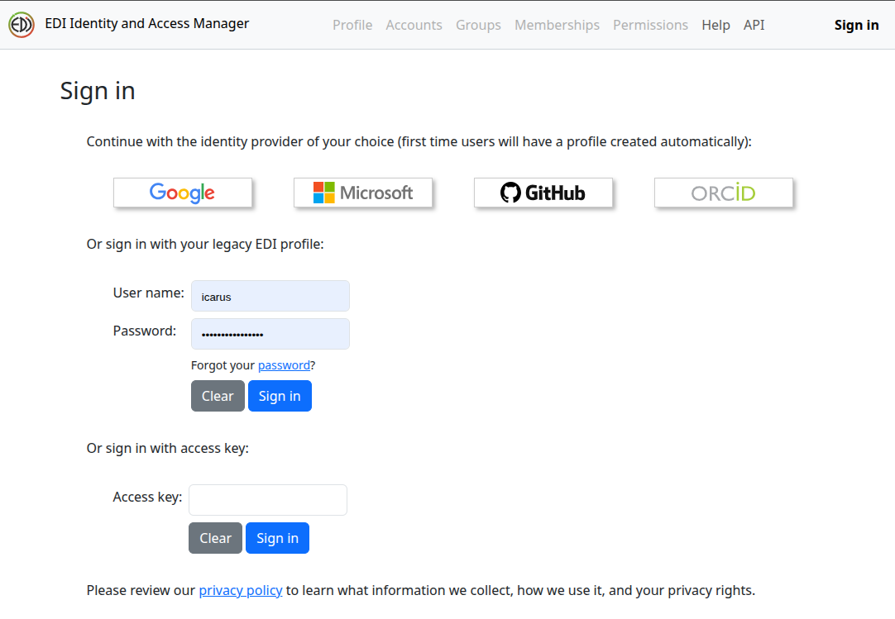
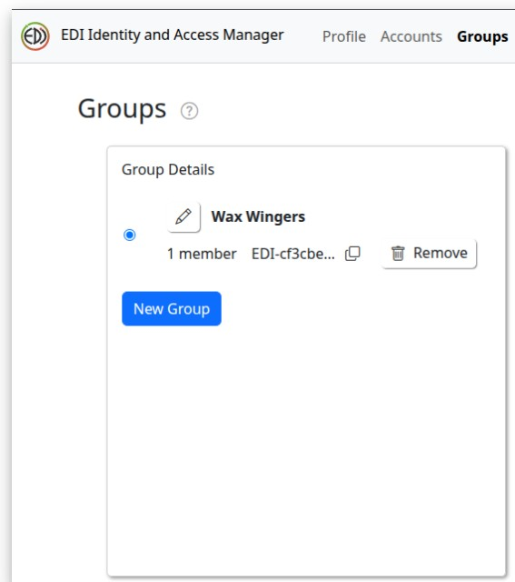
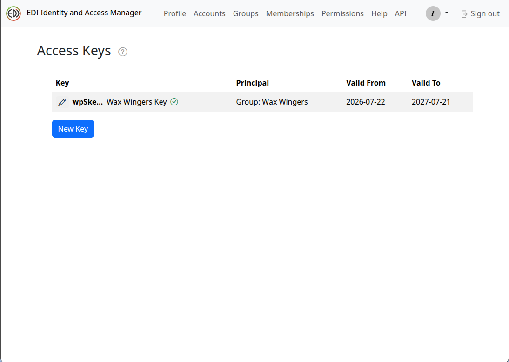

## Overview of download methods

EDI provides several tools and methods for [accessing data](https://edirepository.org/resources/accessing-data). These include Point and Click methods from the data package landing page as well as Data Download scripts in R, Python and MATLAB that are displayed with each package.

The [EDIutils](https://docs.ropensci.org/EDIutils/) R package also provides excellent documentation on how to [Search and Access Data](https://docs.ropensci.org/EDIutils/articles/search_and_access.html) directly from R.

## Download programmatically using R

### Find what you want

```{r load packages, message=FALSE, warning=FALSE}
library (EDIutils) # Handy tools for interacting with EDI's API
library (tidyverse) # For inspecting data
```

If you know the identifier of the data package you want, it's easy to find the latest revision

```{r find latest version , eval = FALSE}
scope <- "knb-lter-nwt" # Niwot scope
identifier <- "314" # Dataset of interest

# ask EDI to tell me what the most current version is
revision <- list_data_package_revisions(scope, identifier, filter = "newest")

# display current version - > this is referred to as the "packageID"
packageID <- paste(scope, identifier, revision, sep = ".")
packageID

```

### Download by package

If you want to download the entire data package, use the function `read_data_package_archive`. Warning some datasets are large so you may not want to read the entire dataset.

```{r download data package, eval = FALSE}
# Download the ENTIRE package to a temporary directory
read_data_package_archive(packageID, path = tempdir())

# Inspect results
list.files(tempdir())

# Download the ENTIRE package to a place you intend to store it for repeated use
# Note you must FIRST create the directory 'some_real_path_on_your_computer'
# before downloading
if (!dir.exists("./some_real_path_on_your_computer")) {
  dir.create("./some_real_path_on_your_computer")
}
read_data_package_archive(packageID, path = "./some_real_path_on_your_computer")

# Inspect results
list.files("./some_real_path_on_your_computer")
```

### Download select entities

It is also possible to read only select portions of the dataset into your analysis pipeline. I find this helpful for sharing code among collaborators - everyone does not need to reinvent the discovery aspect, and there is no need to email files around (which inevitably ends up with someone working on the wrong file).

```{r read selectively, eval = FALSE}
# List data entities of the data package
res <- read_data_entity_names(packageID)
res

```

Using the above mapping information, find the entityID of the data table you want to analyze

```{r find entityID, eval = FALSE}
entityId <- res$entityId[res$entityName == 'Homogenized, gap-filled, daily air temperature']

```

The `read_data_entity_resource_metadata` function provides additional information about each dataset entity. In particular, the resourceID provides the url that directly links to the dataset

```{r find url, eval = FALSE}

entity_resources <- read_data_entity_resource_metadata(packageID, entityId)
url_of_the_table <- entity_resources$resourceId
name_of_the_table <- entity_resources$fileName

```

With the url of the entities, you can down individual data tables. Since authentication is now required (see [Authentication] below), you'll need to append your EDI access key as a `key` query parameter to the `resourceId` URL.

```{r download, eval = FALSE}

# Append your EDI access key (stored as the EDI_API_KEY environment variable,
# see the Authentication section below) as a query parameter
url_with_key <- paste0(url_of_the_table, "?key=", Sys.getenv("EDI_API_KEY"))

download.file(url = url_with_key,
                destfile = file.path('./some_real_path_on_your_computer', name_of_the_table))

```

This method then allows you to read back the data tables you want without the slow step of downloading each time you fix your code.

```{r read downloaded data, eval = FALSE}

my_file <- read.csv(file.path('./some_real_path_on_your_computer', name_of_the_table))
# analyze away
```

### Read data directly into R without a separate download step

Alternatively, you can wrap the code to read the data table directly into your code and never store the file locally.

```{r read directly into R, eval = FALSE}
my_awesome_data <- read_data_entity(packageID, entityId) |>
  # pipe the result to readr::read_csv() to read the data into R
  # readr::read_csv() will guess the column types
  # but sometimes you need to have it scan a larger portion of the than the default
  # first 1000 lines to get the right type
  readr::read_csv(guess_max = 100000)

# analyze away
```

### Authentication

Since **30 July 2026**, authentication has been required to download data programmatically from EDI (as in the examples above). See EDI's [Identity and Access Manager (IAM)](https://edirepository.org/resources/iam) page for full details.

One-time setup:

1. Log in to the [EDI Identity and Access Manager](https://edirepository.org/resources/iam). You can sign in with Google, Microsoft, GitHub, ORCID, or an EDI profile.

{width=50%}

Image credit: EDI
2. Create a group with no members.

{width=50%}

Image credit: EDI
3. Generate an EDI access key for that group. The group should have NO permissions assigned, so it's default permissions will be 'read-only'. Copy the key to your clipboard. Consider this access key like a password - do NOT share.

{width=50%}

Image credit: EDI
4. Add the key to your `.Renviron` file as `EDI_API_KEY` so it's available across R sessions. **Do not commit, push, or otherwise expose this key** — keep `.Renviron` out of version control. If you inadvertently expose your key, please revoke it and generate a new one. This helps EDI from being overwhelmed by bots.

    One way to do this directly from R is to run `Sys.setenv(EDI_API_KEY = "your_key_here")` in the console (note this only persists for the current session, so you'll want to add it to `.Renviron` for it to be available across sessions). You can also edit your `.Renviron` directly using a text editor such as Notepad.

You will also need **EDIutils version 3.0.0 or higher** for this authentication method to work.

```{r authenticate, eval = FALSE}
# Authenticate with EDI using an API key stored as an environment
# variable "EDI_API_KEY" (e.g. via .Renviron locally, or a GitHub Actions secret in
# CI). Never hardcode the key here.
# The key must be generated from EDI's identity and access manager
# https://edirepository.org/resources/iam
# We strongly recommend for analyses scripts you generate a separate access token for
# READ use that does not include WRITE priviledges 
# The easiest way to do this is create a new group with no members and generate a key for that group. You will NOT assign any permissions to this group.
# Copy the key and then set it as an environment variable in your R session
# Note the API key is NOT the same as the group key OR your EDI password. It is a separate API key that is generated for the group you created in the IAM.
Sys.setenv(EDI_API_KEY = "your_key_here")

```